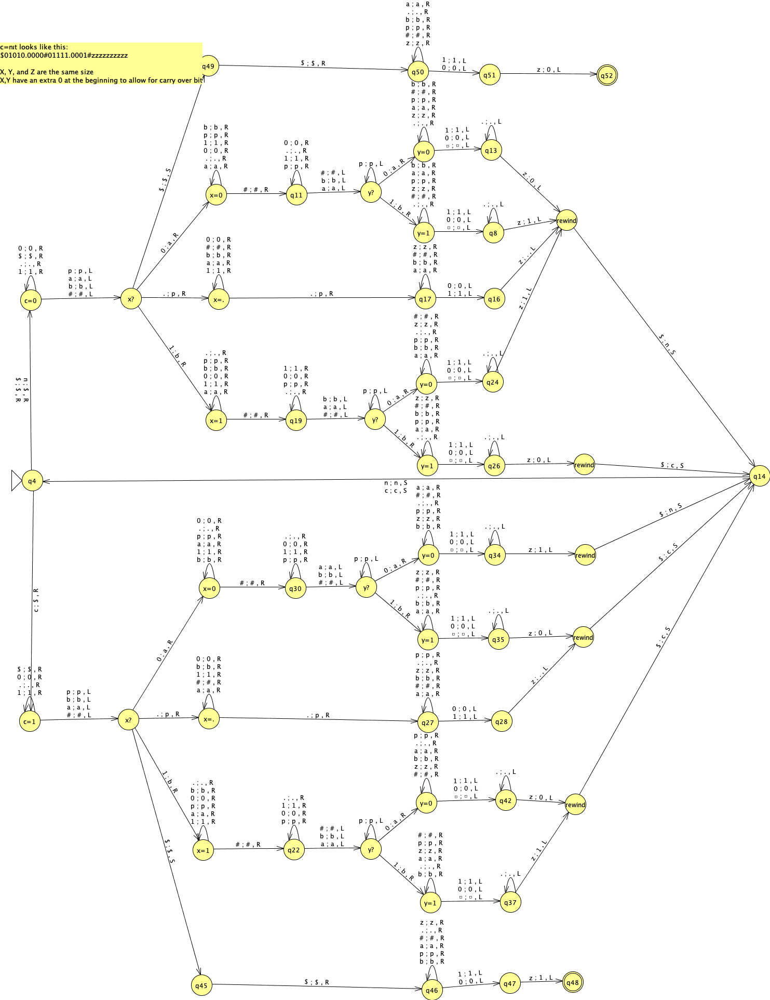

# Binary Real Number Addition with Turing Machines

This project implements a Turing machine in JFLAP that adds two binary real numbers.

## Input Format

The input is of the form `X#Y`, where:

- X and Y are binary real numbers (elements of {0, 1}+.{0, 1}+)
- X = xnxn-1...x1x0.x-1x-2…x-k
- Y = ymym-1...y1y0.y-1y-2…y-l
- Each xi, yi in {0, 1}

## Implementation Details

The Turing machine is:

- Single tape
- One way infinite
- Deterministic

When the machine completes, the tape contains Z (where Z = X + Y), with the read/write head positioned at the leftmost symbol of Z.

### Output Formatting

The output follows these rules:

- No leading 0s to the left of the decimal point (unless Z < 1)
- No trailing 0s to the right of the decimal point (unless Z is an integer)
- Valid examples: `0.1`, `1.0`, `0.0`
- Invalid examples: `01.0`, `1.10`

### Project Structure

This implementation uses multiple JFLAP files that work together:

- `eskenazi_p7.jff` - Main Turing machine implementation
- Supporting files for different operations:
  - Adding integer and decimal parts
  - Counting binary decimal places
  - Padding numbers with zeros
  - Cleaning extra digits

### Binary Addition Block Diagram

This is the core Turing-machine module that takes two equal-length binary numbers (including a "decimal" point) and adds them bit-wise with carry.  It assumes the input is laid out on the tape as $ X . X … X # Y . Y … Y#zzzzzzzzzzz

where:

- **`X` and `Y`** are the two binary operands (each having exactly one `.` and the same number of digits on each side).  
- **`$`** (or sometimes written as `n`) in the leftmost cell is the **no-carry flag**; when a carry is generated it is replaced by `c`.  
- ** `z` at end is a placeholder for the output. There should be as many `z` as bits in `X` and `Y`plus the decimal point. 
For example, 0.1010#0.0101#zzzzzzz

### Tape-symbol conventions

| Symbol | Meaning                              |
|:------:|:-------------------------------------|
| `0`, `1` | unprocessed bits of X or Y           |
| `.`      | radix (decimal) point                |
| `#`      | separator between X and Y            |
| `$` or `n` | no carry pending                    |
| `c`      | carry pending                        |
| `a`      | processed a “0” bit (marked)         |
| `b`      | processed a “1” bit (marked)         |

### High-level operation

1. **Initialize**  
   - Head begins on the leftmost carry-flag cell (`$`/`n`).  
   - `X` and `Y` have been prepended with an extra 0 if necessary to accommodate a final carry.

2. **Find least-significant digit**  
   - Move right, skipping (`$`→`) until you hit the rightmost bit of Y.  
   - Proceed leftward, one tape cell at a time.

3. **Loop over bit-pairs**  
   For each column (starting from the least significant bit of the fractional part, then moving left through the integer part):

   - Read the carry flag (`$`/`n` or `c`).  
   - Read one bit from X and one bit from Y.  
   - Compute `sum = X_bit + Y_bit + carry`.  
   - Write the result bit back into X’s position (as `0`/`1`), then **mark** the original X and Y cells:
     - Replace processed `0` → `a`, processed `1` → `b`.  
   - Update the carry flag:
     - If `sum ≥ 2`, write `c` in the flag cell and write `sum - 2` as the result bit.  
     - Otherwise write `$` (no carry) and write `sum` as the result bit.  

4. **Rewind and repeat**  
   - After each column, the machine rewinds back to the carry-flag cell to fetch the updated carry.  
   - Then it moves right again into the next column to the left.

5. **Finish**  
   - Once both X and Y bits (including the radix point) have been processed and marked, if a final carry (`c`) remains, the machine writes a new leading `1`.  
   - Finally, it rewinds to the left end and enters the halting state.

---

This design ensures:

- **Decimal alignment**: the TM handles the radix point just like any other symbol, so fractional and integer bits are processed in one unified loop.  
- **Carry tracking**: the single‐cell carry flag makes ripple-carry straightforward—no extra states are needed to “remember” carry apart from that one symbol.  
- **In-place marking**: by turning used bits into `a`/`b`, the machine never re-reads the same bit twice, guaranteeing progress toward halting.

## Test Cases

Below is a table of test cases with their expected outputs:

| Input | Expected Output |
|-------|----------------|
| 0.0#0.0 | 0.0 |
| 1.0#0.0 | 1.0 |
| 1.1#0.1 | 10.0 |
| 1.01#0.1 | 1.11 |
| 0.1#0.01 | 0.11 |
| 10.101#1.11 | 100.011 |
| 1.1#10.1 | 100.0 |
| 0.01#100.001 | 100.011 |
| 110.01#1.1 | 111.11 |
| 1.1#111.001 | 1000.101 |
| 1.1#1.1 | 11.0 |
| 111.1#0.1 | 1000.0 |
| 1.111#0.001 | 10.0 |
| 111.111#0.001 | 1000.0 |
| 01.1#0.1 | 10.0 |
| 0.10#0.00 | 0.1 |
| 1.000#0.000 | 1.0 |
| 0.111#0.111 | 1.11 |
| 0.100#0.010 | 0.11 |
| 0.1010#0.0101 | 0.1111 |
| 1.100#0.100 | 10.0 |
| 0.000#0.000 | 0.0 |
| 101010.10101#101010.10101 | 1010101.0101 |
| 100000.00001#0.11111 | 100001.0 |
| 0.111#0.001 | 1.0 |
| 100.1#1.00001 | 101.10001 |
| 111.111#1.001 | 1001.0 |
| 0.1#0.1 | 1.0 |
| 0.01#0.001 | 0.011 |
| 1.1#0.0000001 | 1.1000001 |
| 1000000.0#1.0 | 1000001.0 |
| 0000.0000#0000.0000 | 0.0 |

### Complex Test Cases

The machine is also designed to handle very large binary numbers:

| Input | Expected Output |
|-------|----------------|
| 1001110001000001110101011011010001110.01#1010000111001101000100011100000101.010101 | 1011000001111011011101111110110010011.100101 |
| 000010001000100000000110001000101111.011#0110001100000001010000011010011110.111100 | 1000010100100001010110100011001110.0101 |
| 11111001100110.01101100011111110111#11001010110.1100100000001101 | 100010010111101.00110100100011000111 |
| 0011001110011010111101111011110111.10100011#0000100011100001.000010100100101000000101 | 11001110011010111110011111011000.101011010100101000000101 |
| 011111110101010110.000010011000001000010001#101010101111.01101111000000000000100110101 | 100000100000000101.01111000100000100001101010101 |
| 0010111.0101110001001000001111011010101#01001010.1010100000111001111010111 | 1100010.0000010010000010001010010010101 |
| 0000001011110011000.011000010#0100000001011100010010100001111100.0 | 100000001011100010100000000010100.01100001 |
| 000001011001101010100110.101101011111#0010110010.10111001011000011101111 | 1011001101101011001.01101111010100011101111 |
| 1011101000001.101111001011101011010000#0000100001100011011101000100.1101011100001 | 100001100100111010000110.10010011110000101101 |
| 110111000000111.011010011110011111111001100101100#0000100001100011011101000100.1101011100001 | 100001101010010101001100.0100000011101111111110011001011 |

## Requirements

- JFLAP 7.1 (included as JFLAP7.1.jar)
- Java Runtime Environment

## Running the Project

1. Open JFLAP7.1.jar
2. Load the main project file (`project-7.jff`)
3. Input a string in the format `X#Y` where X and Y are binary real numbers
4. Run the Turing machine

## Notes

- The implementation uses transition symbols from {0, 1, ., #, $, x, a, b, blank space}
- No transitions use JFLAP internal variables
- The machine cannot make use of blank spaces to the left of the input string